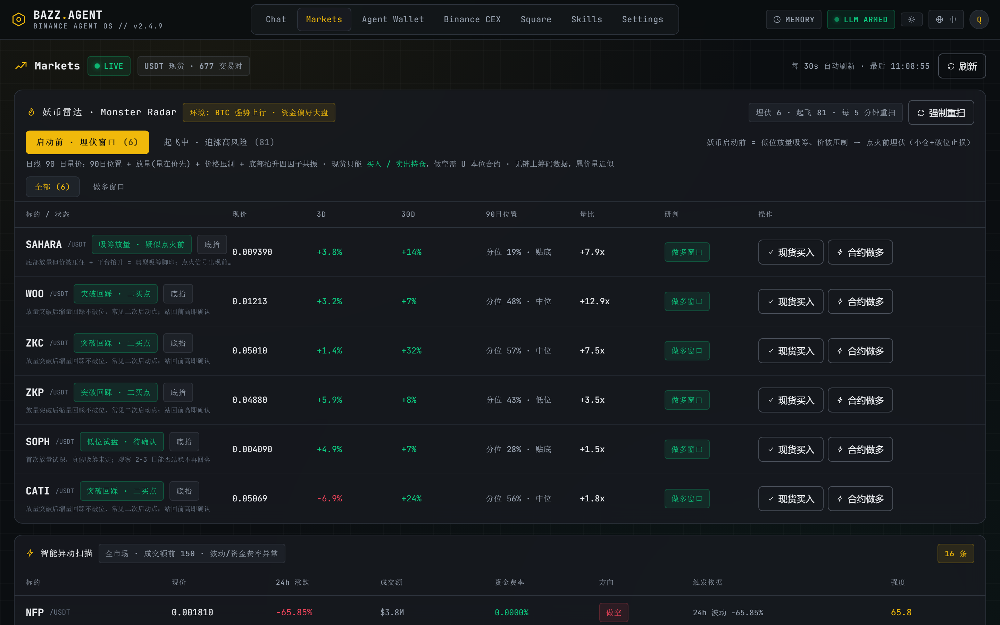
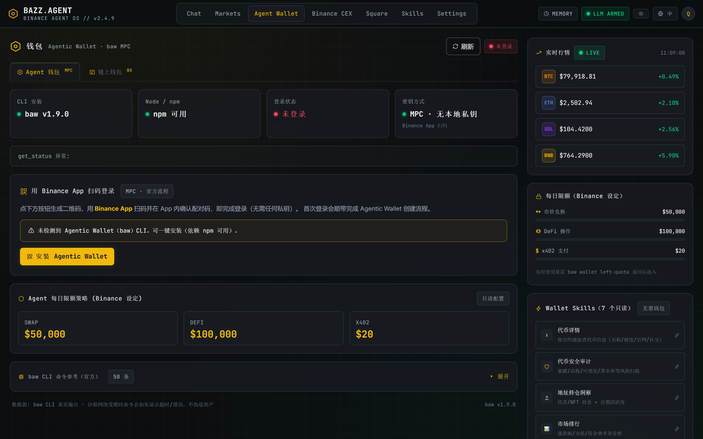
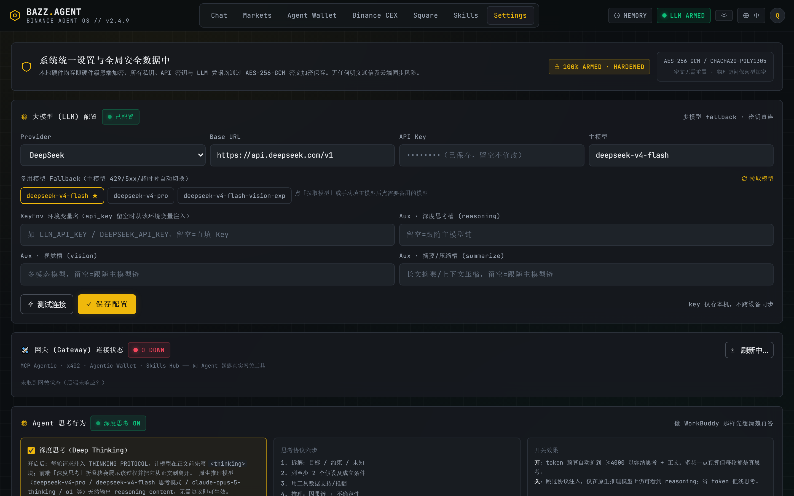
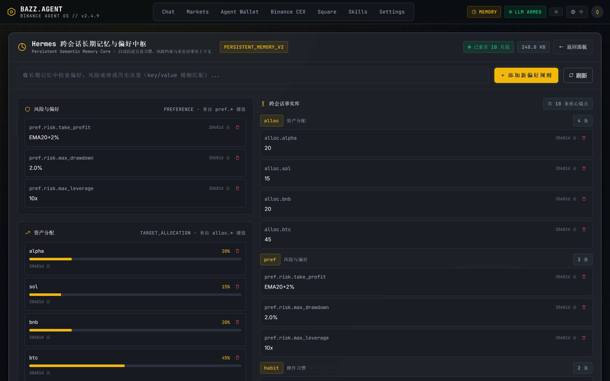

# BAZZ.AGENT — Agent OS Alpha Scout

> **A Binance-native AI trading copilot** — one cockpit that wires the four
> official Agent OS building blocks (MCP Server, Agentic Wallet, x402/B402
> payment, Skill Hub) into a real agent loop: **scan → analyze → propose →
> human approval → execute**.
>
> **Desktop + Web.** Ships as a double-click Windows portable app *and* a
> local web app — same FastAPI core, same React cockpit.

[](https://github.com/xinyuzjj/bazz.agent/releases/latest)
[](https://github.com/xinyuzjj/bazz.agent/releases/latest/download/BAZZ.AGENT-v1.2.12-win32-x64-portable.zip)
[](https://xinyuzjj.github.io/bazz.agent/)
[](./README.zh-CN.md)

[](#-hackathon)
[](#-stack)
[](#-stack)
[](#-stack)
[](#-desktop-app-windows-portable)
[](#-stack)
[](#license)

**Read this in [简体中文](./README.zh-CN.md).**


> 🎬 **88-second live demo video** (real UI walkthrough): open a past session →
> market radar → click “Buy Spot” to jump into chat while the agent analyzes and
> proposes a position → memory → wallet → settings.
> [▶ Watch online (Pages)](https://xinyuzjj.github.io/bazz.agent/#demo) ·
> [⬇ Download MP4 (3.2 MB)](./docs/video/BAZZ-demo-v1.mp4)

---

## Why this exists

Chat bots talk. BAZZ.AGENT **acts** — but only after you say yes.

This is not a chat skin dropped on top of the Binance API. It is an agent
**operating system** for your Binance account: it reads the same real markets
the official Agent OS exposes, runs the four official building blocks
directly, and *every* sensitive action (trade, transfer, signed payment) is
gated behind an explicit human `confirm` in the conversation — then executed
on your real keys / keyless MPC wallet.

The dashboard is a full three-zone trading room in Hermes style:

- left: sessions, personas, tools, files
- center: agent chat with live tool cards & SSE streaming
- right: real-time scanner signals, position & account panels

Dark / light themes and 中 / EN languages are **one click** in the top bar —
and they persist across restarts.

---

## ⭐ Features at a glance

| | What you get |
|---|---|
| 📡 **Real-time market radar** | Full-universe volatility scanner · Monster Radar breakout windows · 24h auto-alerts · live BTC/ETH/SOL/BNB quotes. No API key needed. |
| 🗣 **Conversational agent cockpit** | SSE/NDJSON streaming chat with live tool cards · file & voice input · multi-provider LLM with a deterministic rule-engine fallback that works fully offline. |
| ✅ **Human-in-the-loop by design** | Every trade, transfer and signed payment is gated behind an explicit `confirm` card in the chat — nothing sensitive ever executes silently. |
| 🧠 **Long-term memory** | Cross-session preferences & risk anchors, auto-learned from your conversations, indexed & searchable in the Memory panel. |
| 👛 **Agentic Wallet (keyless MPC)** | BSC / Ethereum / Base / Solana swaps via `baw`, respecting Binance's official daily caps; private keys never pass through the app. |
| 💹 **Real CEX trading** | Spot / futures / convert on your actual exchange account through a whitelisted `binance-cli` profile; CEX and Web3 key systems are strictly separated. |
| 🧩 **Skill Hub** | 14 official Binance skills pre-installed · intent-driven execution · path-traversal-safe install/run/remove. |
| 🔌 **Plugins** | Drop-in extensions (e.g. `plugins/scout-signals`) — a Python `main.py` + manifest hooks into the agent loop without touching core. |
| 🤖 **Multi-bot workspace** | Create any number of persona-driven bots (own skills, own memory scope) and talk to each in its own session. |
| 👥 **Group chat · dispatch tasks to bots** | Build a room, `@mention` several bots and hand them a job — members answer in turns with a shared room log. |
| ⏰ **Scheduled automations (CRON)** | Visual cron panel + per-agent routines: create “scan the market at 09:00” in plain language; run / pause / fire manually. |
| 💸 **x402 / B402 payments** | Machine-to-machine payments with offline Permit2 EIP-712 signing, verified and settled by the official facilitator. |
| 📣 **Square publishing** | Post text / article / image / video to Binance Square with a local ledger of everything you published. |
| 🖥 **Desktop + Web, one codebase** | Frameless Windows portable app (Electron + embedded PyInstaller backend — no Python/Node required) *and* the same cockpit in the browser. |
| 🌓 **Bilingual & themable** | 中 / EN interface and dark/gold ↔ light theme, each one click in the top bar, remembered across restarts. |
| 🔒 **Local-first state** | Sessions, memory and config live in a single `.scout.db` next to the app — move the folder, your workspace moves with it. |

---

## 🚀 Download & run

### Windows portable (recommended)

| Artifact | How to run |
|----------|------------|
| [`BAZZ.AGENT-v1.2.12-win32-x64-portable.zip`](https://github.com/xinyuzjj/bazz.agent/releases/latest/download/BAZZ.AGENT-v1.2.12-win32-x64-portable.zip) | Unzip anywhere → double-click `BAZZ.AGENT.exe` |

- **No Python, no Node, no install.** Electron + PyInstaller fused into one app.
- First launch takes ~3–5 s (embedded backend warm-up), then the cockpit opens.
- State (`.scout.db`) lives next to the exe — move the whole folder anywhere,
  your sessions & memory move with it.
- The window is frameless; drag it by the top bar, and use the ─ / □ / ✕
  buttons on the right of the top bar.

> Built for Windows 10/11 x64. macOS / Linux: run from source below.

### From source (any OS)

```bash
# 1) backend — Python 3.11+
python -m venv .venv && .venv\Scripts\activate    # Windows
# source .venv/bin/activate                        # macOS/Linux
pip install -r requirements.txt

# 2) frontend — React build
cd frontend && npm install && npm run build && cd ..

# 3) launch (backend serves the React build at the same origin)
.venv\Scripts\python -m uvicorn desktop_app:app --host 127.0.0.1 --port 8080
# → http://127.0.0.1:8080
```

> No key needed for the public-market radar (Binance spot tickers & 24h stats).
> The Settings page accepts any OpenAI-compatible `base_url` + key
> (DeepSeek / OpenAI / Moonshot / Ollama / custom), with a rule-engine
> fallback so the cockpit still works fully offline.

### Desktop dev mode (Windows)

```bash
start-desktop.bat     # Electron shell + .venv backend, one double-click
start-dev.bat         # FastAPI + Vite hot-reload for UI iteration
```

---

## 📸 The cockpit, in four panels

| Markets | Agent Wallet |
|:---:|:---:|
|  |  |
| **Settings** | **Memory** |
|  |  |

The four panels you'll spend the most time in: read the market, hold the wallet,
shape the agent, recall what it has learned. Every panel is bilingual (中 / EN)
and respects the dark/gold ↔ light theme — both switch in one click in the top bar.

---

## 🧭 Stack

| Layer | Tech |
|-------|------|
| Agent core | FastAPI + SSE/NDJSON streaming, intent → tool → approval loop |
| LLM | Multi-provider OpenAI-compatible layer with deterministic rule-engine fallback |
| Desktop shell | Electron 31 (frameless) + PyInstaller backend bundle |
| Memory | SQLite (`.scout.db`) — sessions / messages / long-term preferences |
| Frontend | React 18 + TypeScript + Vite + Tailwind (dark/gold ↔ light, 中/EN) |
| Charts | Pure CSS + SVG, zero charting dependencies |
| Realtime | Server-Sent Events + polling |

---

## 🏗 Architecture

```
┌──────────────────────────────────────────────────────────────┐
│              BAZZ.AGENT (desktop & web, same core)             │
│                                                                │
│   Electron (desktop)  ─┐                                       │
│   Browser    (web)  ───┴─► React cockpit ─ HTTP/SSE ─► FastAPI │
│                                                       │        │
│   FastAPI  desktop_app.py                              │        │
│      │            │            │        │        │    │        │
│      ▼            ▼            ▼        ▼        ▼    ▼        │
│  MCP Client   x402 Client   Wallet  binance-cli  Cron  LLM     │
│  (OAuth PKCE) (B402)        (baw)   (CEX HMAC)      +rules    │
│      │                                                         │
│      └──────────────► Binance Agent Native                      │
│                        MCP / Wallet / x402 / Skills Hub        │
│                                                                │
│   SQLite (.scout.db): sessions · messages · memory · jobs      │
└──────────────────────────────────────────────────────────────┘
```

The desktop app embeds a PyInstaller-frozen backend (`ScoutBackend.exe`) and
serves the same React build — **one codebase, two form factors**.

---

## ✨ What the agent can actually do

| Ask the agent… | What happens under the hood |
|----------------|------------------------------|
| “扫描今天的机会” | Full-universe scan → volatility/side filters → signal cards with `needs_approval` |
| “我对 BTC 合约做多” | Jump-to-chat pre-filled prompt → agent proposes leverage/position/SL/TP with the live quote → on confirm, real order via whitelisted channel |
| “查我的币安持仓 / 历史成交” | Signed CEX query (HMAC, binance-cli profile) → readable tables |
| “执行一次 x402 演示” | Offline Permit2 EIP-712 sign → facilitator verify → settle on BSC |
| “帮我发条广场动态” | Square post skill (text/article/image/video) with a local ledger of everything posted |
| “记住：杠杆不超过 10x” | Long-term memory write → injected into future plans as a constraint |
| “发现并安装 X 技能” | Three-source skill discovery (local / community / GitHub API) with approval |
| “建个行情 bot 拉个群，每天把任务丢给它” | Create persona bots → build a room → `@mention` and dispatch jobs; members answer in turns with a shared log |
| “每天早上 9 点扫一遍全市场” | Plain-language CRON → scheduled automation you can run / pause / trigger manually |

---

## 🧩 The Four Native Capabilities — real protocols, not stubs

### 1. MCP Server — `agent.binance.com`

- **Transport**: MCP over Streamable HTTP (JSON-RPC 2.0)
- **Protocol**: `2025-06-18`
- **Auth**: OAuth 2.0 **RFC 9728** resource-metadata challenge → PKCE S256
  browser flow → Bearer token (no API-key Bearer hacks)
- **Discovery**: tools enumerated at runtime via `tools/list` — zero hard-coded names
- **Scopes (least-privilege)**: market reads key-free; balances / positions /
  bills; spot / margin / convert / USDⓈ-M / COIN-M trades; sub-account
  transfers — **no withdrawal scope**
- See `src/mcp_client.py`, APIs under `/api/mcp/*`

### 2. Agentic Wallet — `baw` CLI (keyless MPC)

```bash
npm i -g @binance/agentic-wallet
baw auth signin           # QR → Binance app → approve
baw wallet status
baw market-order swap     # quote / swap / list
baw limit-order buy --json
```

- Multi-chain: BSC / Ethereum / Base / Solana
- Binance-set caps: $50k/day swap · $100k/day DeFi · $20/day x402
- The agent only invokes `baw` through a **whitelisted command shim** —
  private keys never pass through the app (MPC, keyless)

### 3. x402 / B402 — machine-to-machine payments

- B402 Facilitator: `/papi/v2/b402/{supported,verify,settle}` (BNB Smart Chain)
- Flow: seller returns `402` → buyer signs **offline Permit2 EIP-712**
  (no gas) → facilitator verifies → settlement on-chain (facilitator pays gas)
- `/supported` fetched live; graceful demo mode when prod credentials are absent

### 4. Skill Hub — official Binance skills

```bash
npx skills add https://github.com/binance/binance-skills-hub/tree/main/skills/<group>/<skill>
```

- 14 official skills ship pre-installed under `.agents/skills/`
  (lockfile: `skills-lock.json`), plus community skills you approve
- `install / run / remove` with path-traversal protection
- Intent-driven: you say what you want; the skill decides which API to call
- Plugins extend the same runtime via `plugins/<id>/{main.py, plugin.json}`

### And the real CEX channel — binance-cli

Two key systems stay strictly separated (this app never mixes them):

| System | Keys | Used for |
|--------|------|----------|
| **Binance CEX** (exchange account) | API Key + Secret (HMAC, 64-char, System Generated) | spot/futures trades, balances, history via `binance-cli` profile |
| **Web3 Agentic Wallet** | keyless MPC (BX-/Ed25519 via `baw`) | on-chain swaps, x402, DeFi |

---

## 🔌 Backend API surface (selected)

| Method | Path | Notes |
|--------|------|-------|
| `GET` | `/api/status` | MCP / LLM / market / scheduler health |
| `POST` | `/api/chat/stream` | NDJSON streaming chat: `meta / tool / text / data / done` |
| `GET` | `/api/market` | Real-time Binance radar (key-free) |
| `GET/POST` | `/api/wallet` | Agentic Wallet status & whitelisted commands |
| `GET` | `/api/wallet/cex/status` | CEX HMAC + binance-cli profile status |
| `GET/POST/DELETE` | `/api/cron · /api/memory · /api/settings` | jobs / memory / config |
| `GET/POST` | `/api/mcp/*`, `/api/skills/*`, `/api/x402/*` | Native capabilities |

---

## 🔐 Security model

- Every real trade / transfer / signed payment is gated by `needs_approval`;
  the backend only proceeds after an explicit `confirm: true`.
- Keys are never persisted in clear text by the app; CEX keys are entered in
  the UI per session and mirrored into the local `binance-cli` profile only
  after you connect & approve.
- The agent never touches raw private keys — Agentic Wallet is keyless.
- `run_command` is whitelisted to `baw`, `binance-cli`, `node` — arbitrary
  shell is rejected.
- Skills are sandboxed against path traversal; square-post has a local ledger
  with key-masking in the UI.

---

## 📦 Project layout

```
bazz.agent/
├── desktop_app.py            FastAPI backend (serves frontend/dist + /api/*)
├── launcher.py               PyInstaller entry for the desktop backend
├── electron/                 Desktop shell: main.cjs + preload.cjs (frameless)
├── src/
│   ├── agent_core.py         intent → tool orchestration → approval → exec
│   ├── mcp_client.py         Binance Agentic MCP (OAuth 2.0 + runtime discovery)
│   ├── x402_client.py        x402 / B402 payments (Permit2 EIP-712)
│   ├── wallet_client.py      Agentic Wallet (baw CLI wrapper)
│   ├── cex_wallet.py         Binance CEX HMAC client (read + sign)
│   ├── binance_cli.py        real-trade channel: binance-cli profile sync
│   ├── skills_client.py      Skill Hub (install / run / remove)
│   ├── scanner.py            full-universe Binance market radar
│   ├── llm.py                multi-provider LLM + rule-engine fallback
│   ├── scheduler.py          cron daemon
│   └── state.py              SQLite persistence
├── frontend/                 React 18 + TS + Vite + Tailwind (dark/light · 中/EN)
├── plugins/scout-signals/    example plugin
├── .agents/bots/             bot personas · .agents/skills/ 14 official skills
├── wallet_bridge/            Node bridge for the Web3 wallet
└── docs/                     GitHub Pages landing
```

---

## 🏷 Topics

`binance` · `agent-os` · `ai-agent` · `hackathon` · `trading` · `crypto`
· `web3` · `mcp` · `x402` · `oauth` · `electron` · `fastapi` · `react`

---

## 🎯 Hackathon

- **Event**: Binance Agent OS Mini Hackathon — Track A: *Build an AI Agent with Agent OS*
- **Deadline**: 2026-09-08 23:59 UTC
- **Live Pages**: https://xinyuzjj.github.io/bazz.agent/
- **Disclaimer**: a hackathon demo, not investment advice. Crypto trading
  carries real risk; every execution path requires explicit human approval.

---

## License

MIT
