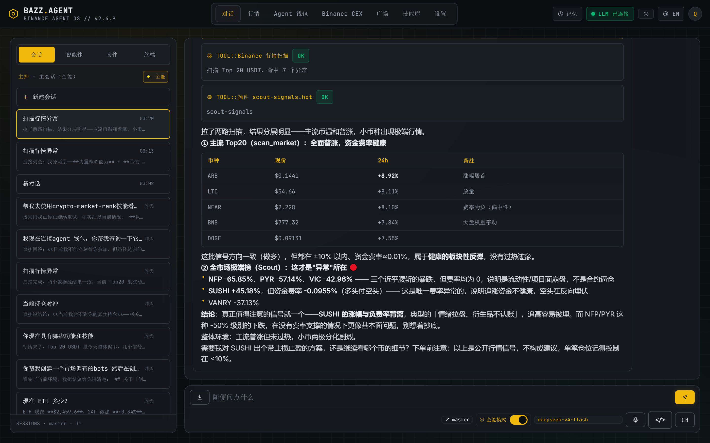
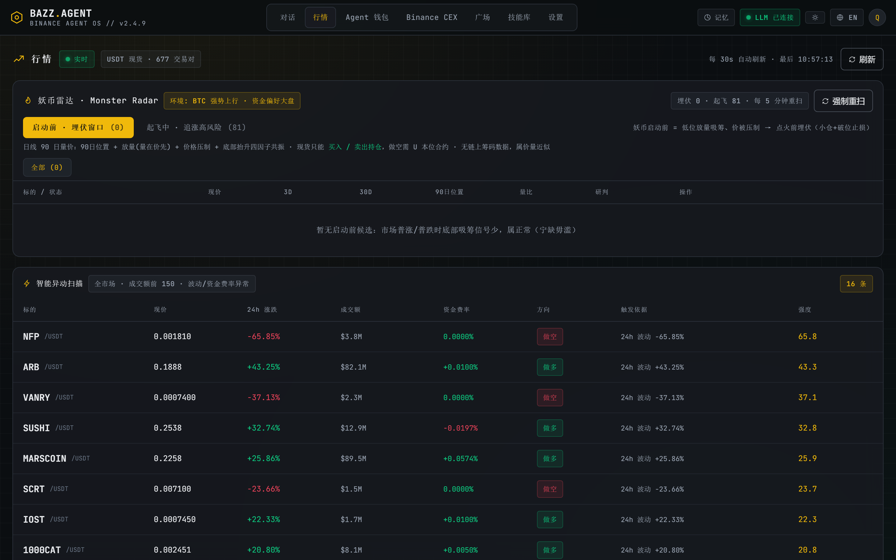
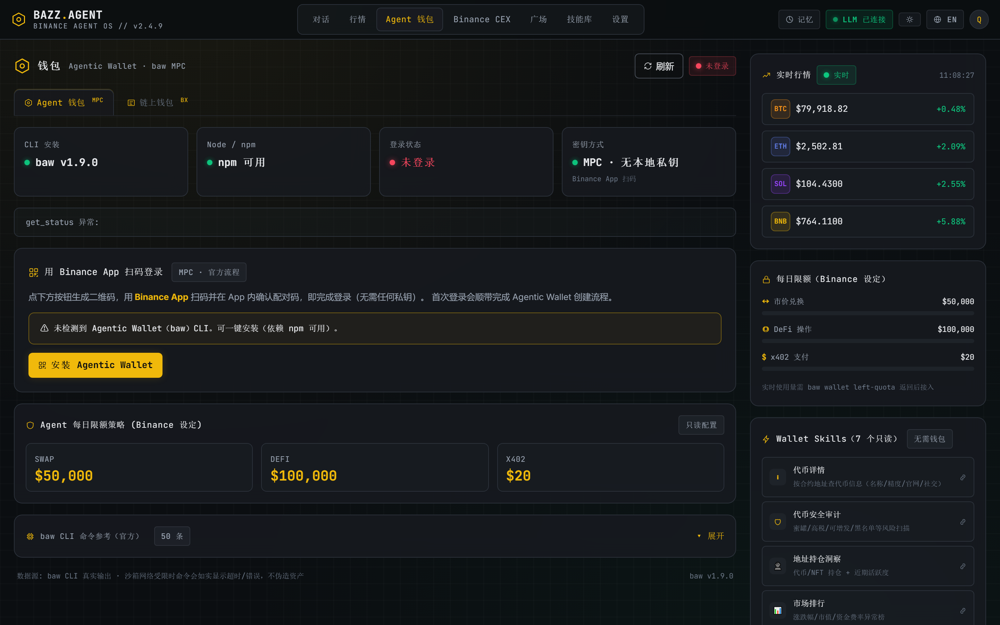
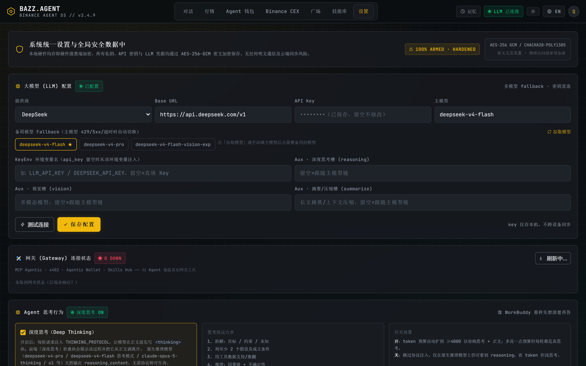
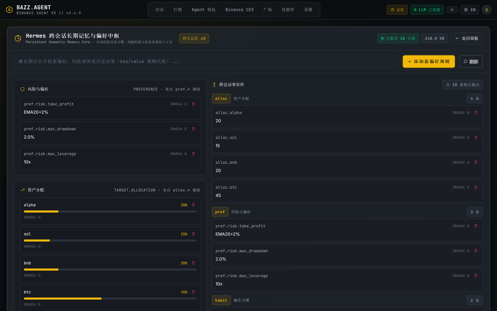

# BAZZ.AGENT — Agent OS Alpha Scout

> **币安原生的 AI 交易副驾。** 把官方 Agent OS 的四块积木——MCP Server、
> Agentic Wallet、x402/B402 机对机支付、Skill Hub——拧进同一个操作舱，
> 跑的是真正的 Agent 闭环：**扫描 → 分析 → 给方案 → 人确认 → 执行**。
>
> **桌面 + Web 双形态**：一个双击即跑的 Windows 便携版，一个本地 Web 版——
> 同一套 FastAPI 核心，同一个 React 驾驶舱。

[](https://github.com/xinyuzjj/bazz.agent/releases/latest)
[](https://github.com/xinyuzjj/bazz.agent/releases/latest/download/BAZZ.AGENT-v1.2.10-win32-x64-portable.zip)
[](https://xinyuzjj.github.io/bazz.agent/)
[](./README.md)

[](#-黑客松)
[](#-技术栈)
[](#-技术栈)
[](#-技术栈)
[](#-桌面版windows-便携)
[](#-技术栈)
[](#license)



> 🎬 **88 秒演示视频**（真实 UI 操作实录）：打开历史会话 → 行情雷达 → 点「现货买入」跳转对话、
> Agent 实盘分析给仓位建议 → 记忆 → 钱包 → 设置。
> [▶ 在线播放（展示页）](https://xinyuzjj.github.io/bazz.agent/#demo) ·
> [⬇ 下载 MP4（3.2 MB）](./docs/video/BAZZ-demo-v1.mp4)

---

## 为什么会有这个项目

聊天机器人只负责“聊”。BAZZ.AGENT 会**动手**——但只有你说“确认”之后才动。

它不是套在币安 API 上的一层聊天皮，而是你的币安账户的一个**Agent 操作系统**：
它读的是官方 Agent OS 暴露的真实市场，直接调用四块官方积木；任何敏感动作
（下单、转账、签名支付）都会在对话里弹出人类确认卡，`confirm` 之后才真正执行，
走的是你的真实密钥或 MPC 无密钥钱包。

驾驶舱是 Hermes 风格的三区交易室：

- 左栏：会话、人格、工具、文件
- 中栏：Agent 对话 + 实时工具卡片 + SSE 流式输出
- 右栏：全市场雷达信号、账户与持仓面板

**深色/浅色主题、中/英文界面，顶栏一键切换，重启后自动记住。**

---

## ⭐ 功能特点一览

| | 你能得到什么 |
|---|---|
| 📡 **实时行情雷达** | 全市场异动扫描 · Monster Radar 爆发窗口 · 24h 自动告警 · BTC/ETH/SOL/BNB 实时报价，无需任何 Key。 |
| 🗣 **对话式 Agent 驾驶舱** | SSE/NDJSON 流式对话 + 实时工具卡片 · 文件与语音输入 · 多供应商 LLM，内置确定性规则引擎兜底——不配模型也完整可用。 |
| ✅ **人工确认制** | 每一次下单、转账、签名支付都会在对话里弹出 `confirm` 确认卡——没有任何敏感操作会被静默执行。 |
| 🧠 **长期记忆** | 跨会话偏好与风控锚点，从对话中自动学习，可检索、可管理（见「记忆」面板）。 |
| 👛 **Agentic Wallet（无密钥 MPC）** | 经 `baw` 打通 BSC / Ethereum / Base / Solana 链上兑换，遵守币安官方每日限额；私钥永不经过本应用。 |
| 💹 **真实 CEX 交易** | 通过白名单 `binance-cli` profile 在真实交易所账户做现货/合约/闪兑；交易所与 Web3 两套密钥体系严格隔离。 |
| 🧩 **Skill Hub** | 预装 14 个官方 Binance 技能 · 意图驱动执行 · install/run/remove 全程防路径穿越。 |
| 🔌 **插件** | 即插即用扩展（如 `plugins/scout-signals`）：一个 Python `main.py` + 清单即可挂进 Agent 循环，不改核心。 |
| 🤖 **多 Bots 工作区** | 创建任意多个带人格的 Bots（各自技能与记忆域），与每个 Bot 在独立会话里对话。 |
| 👥 **群聊 · 给 Bots 派活** | 建群组、`@` 多个 Bot 下发任务，成员轮流作答，共享群聊日志。 |
| ⏰ **定时任务（CRON）** | 可视化 Cron 面板 + 每个 Agent 的 Routines：自然语言说「每天早上 9 点扫盘」，可运行 / 暂停 / 手动触发。 |
| 💸 **x402 / B402 支付** | 机对机支付：离线 Permit2 EIP-712 签名，由官方 Facilitator 校验并链上结算。 |
| 📣 **广场发帖** | 文字/文章/图文/视频发布到币安广场，本地台账记录全部已发内容。 |
| 🖥 **桌面 + Web 一套代码** | 无边框 Windows 便携版（Electron + 内嵌 PyInstaller 后端，无需 Python/Node）与浏览器里同一个驾驶舱。 |
| 🌓 **双语 + 双主题** | 中 / EN 界面、深色 ↔ 浅色主题，顶栏一键切换，重启自动记住。 |
| 🔒 **本地优先的数据** | 会话、记忆、配置全在应用旁的单个 `.scout.db`——整个文件夹随意搬家，工作区跟着走。 |

---

## 🚀 下载与运行

### Windows 便携版（推荐）

| 文件 | 用法 |
|------|------|
| [`BAZZ.AGENT-v1.2.10-win32-x64-portable.zip`](https://github.com/xinyuzjj/bazz.agent/releases/latest/download/BAZZ.AGENT-v1.2.10-win32-x64-portable.zip) | 解压到任意目录 → 双击 `BAZZ.AGENT.exe` |

- **无需 Python、无需 Node、无需安装**。Electron + PyInstaller 熔成一体。
- 首次启动约 3–5 秒（内嵌后端预热），随后驾驶舱打开。
- 数据（`.scout.db`）生成在 exe 旁边——整个文件夹随便搬家，会话与记忆跟着走。
- 窗口是无边框的：按住顶栏任意空白处拖动；最小化/最大化/关闭在顶栏最右边
  （─ / □ / ✕）。

> 面向 Windows 10/11 x64。macOS / Linux 用户请从源码运行（见下）。

### 从源码运行（全平台）

```bash
# 1) 后端 —— Python 3.11+
python -m venv .venv && .venv\Scripts\activate    # Windows
# source .venv/bin/activate                        # macOS/Linux
pip install -r requirements.txt

# 2) 前端 —— React 构建
cd frontend && npm install && npm run build && cd ..

# 3) 启动（后端同源托管 React 构建产物）
.venv\Scripts\python -m uvicorn desktop_app:app --host 127.0.0.1 --port 8080
# → http://127.0.0.1:8080
```

> 公开行情雷达无需任何 Key（币安现货实时价与 24h 统计）。
> 设置页兼容任意 OpenAI 风格 `base_url` + API Key（DeepSeek / OpenAI /
> Moonshot / Ollama / 自建网关），内置规则引擎兜底——不配模型也完整可用。

### 桌面开发模式（Windows）

```bash
start-desktop.bat     # Electron 壳 + .venv 后端，一键双击
start-dev.bat         # FastAPI + Vite 热更新，UI 快速迭代用
```

---

## 📸 驾驶舱，四张主面板

| 行情 | Agent 钱包 |
|:---:|:---:|
|  |  |
| **设置** | **记忆** |
|  |  |

四个花得时间最多的面板：读市场、握钱包、塑 Agent、翻记忆。中 / EN 双语、
深色 ↔ 浅色主题顶栏一键切换，重启后自动保留。

---

## 🧭 技术栈

| 层 | 技术 |
|----|------|
| Agent 核心 | FastAPI + SSE/NDJSON 流式，意图 → 工具 → 确认 → 执行 |
| LLM | 多供应商 OpenAI 兼容层 + 确定性规则引擎兜底 |
| 桌面壳 | Electron 31（无边框）+ PyInstaller 后端打包 |
| 记忆 | SQLite（`.scout.db`）——会话 / 消息 / 长期偏好 |
| 前端 | React 18 + TypeScript + Vite + Tailwind（深/浅色 · 中/EN） |
| 图表 | 纯 CSS + SVG，零图表库依赖 |
| 实时 | Server-Sent Events + 轮询 |

---

## 🏗 架构

```
┌──────────────────────────────────────────────────────────────┐
│               BAZZ.AGENT（桌面版与 Web 版同一核心）              │
│                                                              │
│   Electron（桌面）──┐                                          │
│   浏览器    （Web）──┴─► React 驾驶舱 ─ HTTP/SSE ─► FastAPI     │
│                                                      │        │
│   FastAPI desktop_app.py                             │        │
│      │         │          │        │        │       │        │
│      ▼         ▼          ▼        ▼        ▼       ▼        │
│  MCP 客户端 x402 客户端  Wallet  binance-cli 定时任务  LLM      │
│  (PKCE 授权) (B402)     (baw)    (CEX HMAC)         +规则引擎 │
│      │                                                        │
│      └────────────► Binance Agent 原生能力                      │
│                      MCP / Wallet / x402 / Skill Hub          │
│                                                              │
│   SQLite (.scout.db)：会话 · 消息 · 记忆 · 定时任务              │
└──────────────────────────────────────────────────────────────┘
```

桌面版内嵌 PyInstaller 冻结的后端（`ScoutBackend.exe`），托管同一份 React
构建——**一套代码，两种形态**。

---

## ✨ Agent 真能做什么

| 对 Agent 说… | 底层实际发生什么 |
|--------------|------------------|
| “扫描今天的机会” | 全市场扫描 → 波动率/方向过滤 → 信号卡片（带 `needs_approval`） |
| “我对 BTC 合约做多” | 行情按钮一键跳对话自动提问 → 结合实时价给杠杆/仓位/止损/目标 → 确认后走白名单通道真实下单 |
| “查我的持仓 / 历史成交” | 签名 CEX 查询（HMAC、binance-cli profile）→ 可读表格 |
| “跑一次 x402 演示” | 离线 Permit2 EIP-712 签名 → 官方 Facilitator 校验 → BSC 结算 |
| “帮我发条广场动态” | 广场发帖技能（文字/文章/图文/视频），本地台账记录一切已发内容 |
| “记住：杠杆不超过 10x” | 写入长期记忆 → 之后每次给方案自动带上这条约束 |
| “发现并安装 X 技能” | 三段式技能发现（本地 / 社区 / GitHub API），安装需审批 |
| “建个行情 bot 拉个群，每天把任务丢给它” | 创建人格 Bots → 建群组 → `@` 提及下发任务，成员轮流作答、共享群聊日志 |
| “每天早上 9 点扫一遍全市场” | 自然语言创建 CRON 定时任务，可运行 / 暂停 / 手动触发 |

---

## 🧩 四块原生能力——真协议，不是空壳

### 1. MCP Server — `agent.binance.com`

- **传输**：MCP over Streamable HTTP（JSON-RPC 2.0）
- **协议**：`2025-06-18`
- **鉴权**：OAuth 2.0 **RFC 9728** 资源元数据挑战 → PKCE S256 浏览器流 →
  Bearer token（不是拿 API Key 硬凑 Bearer）
- **工具发现**：运行时 `tools/list` 枚举，代码里零硬编码工具名
- **权限（最小化）**：行情免 Key；余额/持仓/账单；现货/杠杆/闪兑/USDⓈ-M/
  COIN-M 交易；子账户划转——**不含提现 scope**
- 见 `src/mcp_client.py`，接口在 `/api/mcp/*`

### 2. Agentic Wallet — `baw` CLI（无密钥 MPC）

```bash
npm i -g @binance/agentic-wallet
baw auth signin           # 扫码 → 币安 App → 授权
baw wallet status
baw market-order swap     # 报价 / 兑换 / 列表
baw limit-order buy --json
```

- 多链：BSC / Ethereum / Base / Solana
- 币安设定限额：兑换 $50k/天 · DeFi $100k/天 · x402 $20/天
- Agent 只能通过**白名单命令壳**调用 `baw`——私钥永远不经过本应用（MPC 无密钥）

### 3. x402 / B402 — 机对机支付

- B402 Facilitator：`/papi/v2/b402/{supported,verify,settle}`（BNB Smart Chain）
- 流程：卖家回 `402` → 买家**离线签 Permit2 EIP-712**（不花 gas）→
  Facilitator 校验 → 链上结算（Facilitator 出 gas）
- `/supported` 实时拉取；缺生产凭据时优雅降级到演示模式

### 4. Skill Hub — 官方币安技能

```bash
npx skills add https://github.com/binance/binance-skills-hub/tree/main/skills/<group>/<skill>
```

- 14 个官方技能预装于 `.agents/skills/`（lockfile：`skills-lock.json`），
  社区技能经你审批后也可装
- `install / run / remove` 全程防路径穿越
- 意图驱动：你说要什么，技能自己决定调哪个 API
- 插件同构扩展：`plugins/<id>/{main.py, plugin.json}`

### 真实 CEX 通道 —— binance-cli

**两套密钥体系在这套应用里严格隔离，绝不混用**：

| 体系 | 密钥 | 用途 |
|------|------|------|
| **币安 CEX**（交易所账户） | API Key + Secret（HMAC，64 字符，System Generated） | 现货/合约下单、余额、成交历史，经 `binance-cli` profile |
| **Web3 Agentic Wallet** | 无密钥 MPC（BX-/Ed25519，经 `baw`） | 链上兑换、x402、DeFi |

---

## 🔌 后端 API 一览（节选）

| 方法 | 路径 | 说明 |
|------|------|------|
| `GET` | `/api/status` | MCP / LLM / 行情 / 调度健康度 |
| `POST` | `/api/chat/stream` | NDJSON 流式对话：`meta / tool / text / data / done` |
| `GET` | `/api/market` | 实时币安雷达（免 Key） |
| `GET/POST` | `/api/wallet` | Agentic Wallet 状态与白名单命令 |
| `GET` | `/api/wallet/cex/status` | CEX HMAC + binance-cli profile 状态 |
| `GET/POST/DELETE` | `/api/cron · /api/memory · /api/settings` | 定时任务 / 记忆 / 配置 |
| `GET/POST` | `/api/mcp/*`、`/api/skills/*`、`/api/x402/*` | 原生能力 |

---

## 🔐 安全模型

- 所有真实下单 / 转账 / 签名支付都走 `needs_approval`；后端只在收到
  显式 `confirm: true` 后才继续。
- 密钥不会明文落盘：CEX Key 在界面按会话填写，只有你连接并确认后才会
  镜像进本地 `binance-cli` profile；断连即删除。
- Agent 永远不碰私钥——Agentic Wallet 无密钥。
- `run_command` 只白名单 `baw`、`binance-cli`、`node`——任意 shell 一律拒绝。
- 技能防路径穿越；广场发帖带本地台账，前端只显示掩码 Key。

---

## 📦 项目结构

```
bazz.agent/
├── desktop_app.py            FastAPI 后端（托管 frontend/dist + /api/*）
├── launcher.py               PyInstaller 打包桌面后端的入口
├── electron/                 桌面壳：main.cjs + preload.cjs（无边框）
├── src/
│   ├── agent_core.py         意图 → 工具编排 → 审批 → 执行
│   ├── mcp_client.py         币安 Agentic MCP（OAuth 2.0 + 运行时发现）
│   ├── x402_client.py        x402 / B402 支付（Permit2 EIP-712）
│   ├── wallet_client.py      Agentic Wallet（baw CLI 封装）
│   ├── cex_wallet.py         币安 CEX HMAC 客户端（读 + 签名）
│   ├── binance_cli.py        真实下单通道：binance-cli profile 同步
│   ├── skills_client.py      Skill Hub（安装 / 运行 / 删除）
│   ├── scanner.py            全市场行情雷达
│   ├── llm.py                多供应商 LLM + 规则引擎兜底
│   ├── scheduler.py          定时任务守护
│   └── state.py              SQLite 持久化
├── frontend/                 React 18 + TS + Vite + Tailwind（深/浅色 · 中/EN）
├── plugins/scout-signals/    示例插件
├── .agents/bots/             机器人人格 · .agents/skills/ 14 个官方技能
├── wallet_bridge/            Web3 钱包用的 Node 桥
└── docs/                     GitHub Pages 落地页
```

---

## 🏷 标签

`binance` · `agent-os` · `ai-agent` · `hackathon` · `trading` · `crypto`
· `web3` · `mcp` · `x402` · `oauth` · `electron` · `fastapi` · `react`

---

## 🎯 黑客松

- **赛事**：Binance Agent OS Mini Hackathon — Track A：*Build an AI Agent with Agent OS*
- **截止**：2026-09-08 23:59 UTC
- **在线展示页**：https://xinyuzjj.github.io/bazz.agent/
- **声明**：这是黑客松演示项目，不构成任何投资建议。加密资产交易有真实风险，
  所有执行路径都需要明确的人工确认。

---

## License

MIT
